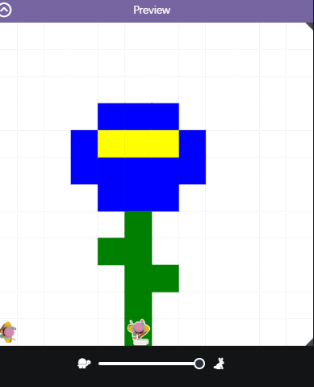

# asphalt-art-project

# Unit 1 - Asphalt Art

## Introduction

Cities use asphalt art to improve public safety, inspire their residents and visitors, and brighten communities. Your goal is to create asphalt art to revitalize The Neighborhood and bring the community together with the help of the Painter.

## Requirements

Use your knowledge of object-oriented programming, algorithms, the problem solving process, and decomposition strategies to create asphalt art:
- **Create a new subclass** – Create at least one new subclass of the PainterPlus class that is used for a component of the asphalt art design.
- **Plan an algorithm** – Use the problem solving process and decomposition strategies to plan an algorithm that incorporates a combination of sequencing, selection, and/or iteration.
- **Write a method** – Write at least one method in a PainterPlus subclass that contributes to a component of the asphalt art design.
- **Document your code** – Use comments to explain the purpose of the methods and code segments.

## Notes: Neighborhood & Painter Class

This project was created on Code.org's JavaLab platform using the built-in Neighborhood GUI output. To test and edit this project you must build in Code.org's JavaLab with the Neighborhood GUI enabled. For reference to the Painter class documentation, [you can read more here.](https://studio.code.org/docs/ide/javalab/classes/Painter)

## Output:

## Reflection

1. Describe your project.

   - I decided to draw a simple blue flower with a center and a stem. I chose the 12x12 grid to make the code more simple and so I can really grasp the concept of how to code and use methods correctly.

2. What are two things about your project that you are proud of?

    - The first thing I am proud of my project is that I was able to make the code run without any syntax errors. Even though it took some debugging, I eventually got it to work. Another thing that I am proud of is that the output looks like a flower, and not some random painting. I am proud that I was able to code correctly so the painter could paint the flower I wanted it to paint.
3. Describe something you would improve or do differently if you had an opportunity to change something about your project.

   - Something that I would like to do differently is if I had more time, I would make the flower more detailed and complex, also adding more methods to my code.
